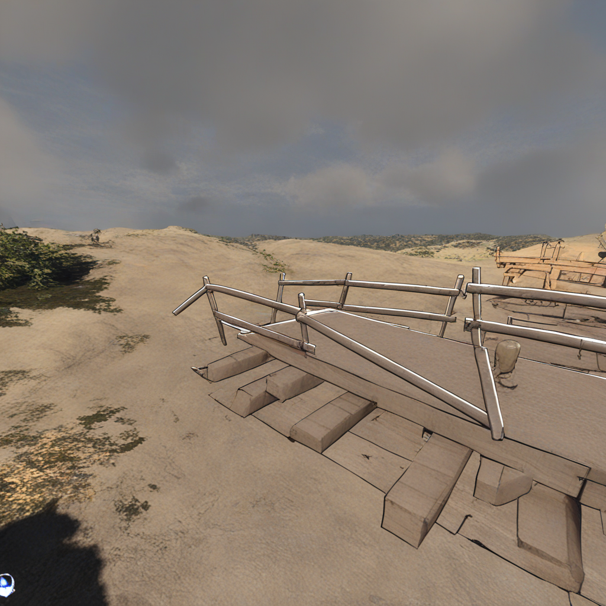

# ControlNeXt-SD3

This repository contains an implementation of ControlNeXt for Stable Diffusion 3. ControlNeXt is a novel approach to integrating control signals into diffusion models, allowing for more precise and flexible control over image generation. This implementation is built on top of the Hugging Face `diffusers` library.

## Installation

To get started, clone the repository and install the required dependencies:

```bash
git clone https://github.com/your-username/ControlNeXt-SD3.git
cd ControlNeXt-SD3
pip install -r requirements.txt
```

## Usage

### Training

To train a new ControlNeXt model, you can use the `train_controlnet_sd3.py` script located in the `examples/controlnet` directory. Here is an example command:

```bash
accelerate launch examples/controlnet/train_controlnet_sd3.py \
    --pretrained_model_name_or_path="stabilityai/stable-diffusion-3-medium-diffusers" \
    --output_dir="controlnet-model" \
    --dataset_name="fusing/fill50k" \
    --conditioning_image_column="conditioning_image" \
    --image_column="image" \
    --caption_column="text" \
    --resolution=1024 \
    --learning_rate=1e-5 \
    --train_batch_size=1 \
    --num_train_epochs=1 \
    --validation_image="./conditioning_image.png" \
    --validation_prompt="A monster under the bed" \
    --report_to="wandb"
```

Make sure to replace the `--dataset_name` and other arguments with your own data and desired configuration.

### Inference

For inference, you can use the `pipeline_stable_diffusion_3_controlnet.py` pipeline. Here is an example of how to use it:

```python
import torch
from diffusers import StableDiffusion3ControlNeXtPipeline
from diffusers.models import SD3ControlNetModel
from diffusers.utils import load_image

controlnet = SD3ControlNetModel.from_pretrained("InstantX/SD3-Controlnet-Canny", torch_dtype=torch.float16)
pipe = StableDiffusion3ControlNeXtPipeline.from_pretrained(
    "stabilityai/stable-diffusion-3-medium-diffusers", controlnet=controlnet, torch_dtype=torch.float16
)
pipe.to("cuda")

control_image = load_image(
    "https://huggingface.co/datasets/hf-internal-testing/diffusers-images/resolve/main/sd_controlnet/bird_canny.png"
)
prompt = "A bird in space"

image = pipe(
    prompt, control_image=control_image, height=1024, width=768, controlnet_conditioning_scale=0.7
).images[0]

image.save("sd3.png")
```

## Results

Here are some example images generated with this model:

### Self-Trained Depth Model

| Original | Generated 0 | Generated 1 | Generated 2 | Generated 3 |
|---|---|---|---|---|
|  |  |  |  |  |
|  |  |  |  |  |

### Sampler Experiments

Here are some images generated with different sampler settings:

#### 20 Steps, Scale 1.0


#### 30 Steps, Scale 1.0


#### 50 Steps, Scale 1.0


